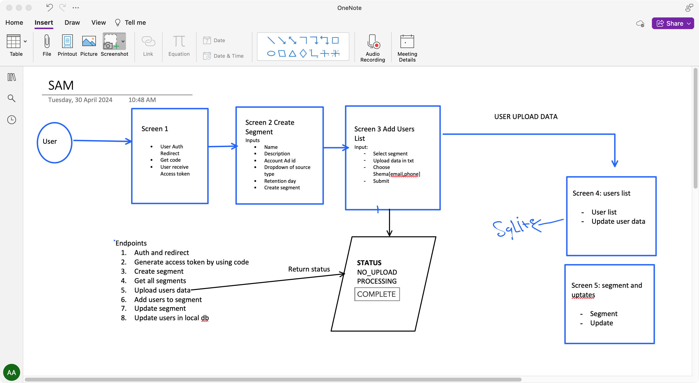

# SAM Task

Snap Audience Match (Customer List)

SAM is an application that takes a customer list and pushes it to a custom Snapchat segment.

## Tech Used

- Frontend: React.js
- Backend: Node.js Express

## Structure

- Monorepo

## How to Run the Code

1. Clone the repository.
2. Create an ngrok domain and add it to the OAuth app in your Snapchat account.
3. Change the `.env.example` file in the backend folder and remove the `.example`.

   ```plaintext
   OAUTH_APP_CLIENT_ID=ADD YOUR CLIENT ID HERE
   OAUTH_APP_CLIENT_SECRET=ADD YOUR CLIENT SECRET HERE
   OAUTH_APP_REDIRECT_URI="ADD YOUR REDIRECT ngrok URI HERE/dash/segments" // It is important to keep /dash/segments. For example, "https://example.com/dash/segments"

   SNAPCHAT_URL=https://accounts.snapchat.com/login/oauth2
   SNAPCHAT_API=https://adsapi.snapchat.com/v1
   ```

4. Navigate to the backend folder and run:

   ```bash
   npm install
   ```

5. Navigate to the frontend folder and run:

   ```bash
   npm install
   ```

6. Go back to the main folder and run:

   ```bash
   npm install
   npm start
   ```

7. You will get:

   ```
   http://localhost:5173
   ```

8. Make your ngrok domain point to this 5173 by using:

   ```
   ngrok http --domain=example-domain.ngrok-free.app 5173
   ```

   Change "example-domain.ngrok-free.app" with your domain.

## Brainstorming


